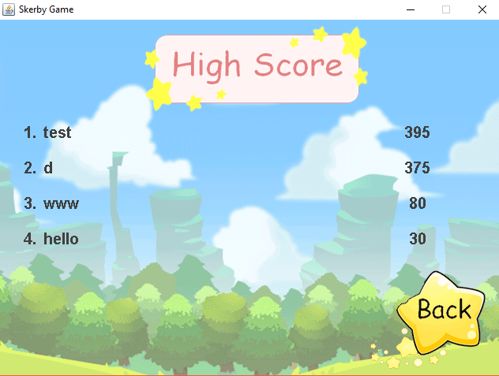

# Skerby-Game

## Skerby Game	
   
   
   
   


   This application is a 2D adventure game where players fight enemies found on the map to clear the stage to adventure on the map and fight with monsters to clear the stage on a 2D land. Try to save your life from the monster and get more score as much as possible. If a player is attacked by the monster and his HP equals to 0, the player will die. So, the player will initialize a new game on the start of the map.	
   
   
   
   


       
## Game's contain
 
 ##### **How to play**
   In this game, the player must type commands


   


   Try to catch items which are useful such as donut and health but, try to avoid the poison.
      
      
      
   
 
 
 
 ##### **Database System**
   This application has 'Database System' to collect name of each player and record the scores who got in this game.
   
   
   
   
 
 
 
 ##### **Score System**
   This application has 'Score System' which can show the high-score board with top 5 players score when a player die or clear the stage, The system will record player's name and player's score. Players can see high-score board how much each player get score in this game.
   
   
   
   
   
   
   
 ##### **More button features**
- Click 'Start' button to prepare for playing game.
- Click 'How to play' button to see the command's details and items in this game.
- Click 'High Score' button to show the high-score board.
- Click 'Back' button to return back to last frame you came.
- Click 'Next' button to skip to next frame of details.
- Click 'Enter' button to confirm your name and play the game.
- Click 'Play Again' button to play this game once again at the beginning of the stage.
- Click 'Main Menu' button to turn back to main menu to select the commands.
- Click 'Exit' button to stop playing this game.
    
    
    
    


 ## How to install the game?
 - Download and clone [SkerbyGame](https://github.com/Driveiei/Skerby-Game).
 - Search SkerbyGame/dist folders and click Skerby.jar to play this game (in dist folder must have score.txt and Skerby.jar).
  'Note' To run this application, your computer must has Java version 8 or newer.


 ## How does it use what we learned in this course?
 
 - 'Input Stream' and 'ClassLoader' => Using in 'High Score' board to read data from text file (score.txt).
 ```
     ClassLoader loader = ScoreManager.class.getClassLoader();
     InputStream in = loader.getResourceAsStream(filename);
 ```

 - 'OutputSream' => Writing name and score to data in text file (score.txt).
 ```
     String outputfile = "score.txt";
     OutputStream out = null;
     PrintStream printOut = new PrintStream(out);
 ```

 - 'Arraylist' and 'Array' => Collecting the data of building, coin, item, and enemy in the game.
 ```
     private Score[] fiveScore = new Score[5];
     private static ArrayList<Items> itemsList = new ArrayList<>();
 ```

 - 'Object', 'Inheritance', and 'Polymorphism' => Linking the class to be proportionated and more comfortable while coding.
 ```
     private static ArrayList<Coins> cl = CoinsManager.getCoinsBounds();
     public class ItemsInterface extends javax.swing.JFrame{...}
 ```

 - 'Try and Catch exception' => Checking the file which be written or not and Avoiding some errors when coding.
 ```
     try {
         out = new FileOutputStream(outputfile, true);
     } catch (FileNotFoundException ex) {
         System.out.println("Couldn't open output file " + outputfile);
         return;
     }
 ```
        
 - 'Hero’s Adventure (Idea)' and 'Loop from e-lab' => Some logic be used in this game to fixed bug and make constructor easier while coding.
 ```
     public BlockManager(int x , int y ,int column ,int roll){
    	   this.x = x;
       	this.y = y;
    	   this.column = column;
       	this.roll = roll;
        for (int i = x; i < x + (column*boxSize); i+=boxSize){
            for (int j = y; j < y + (roll*boxSize); j+=boxSize){
                addBlock(new Block(i,j));
            }
        }
     }
 ```
 
  - 'Make .jar file' => use to merge all java classes and images file to be a file that can use to run the application.
     
     
     
     


 ## What does we learn from doing this project?
 - Using Java Swing to draw 'Graphic User Interface' to use Jframe and JPanel form.
     These are lots of command's examples we use in this project.
 ```
    window.setSize(WIDTH, HEIGHT);
      => to set the size of JFrame.
	  	window.setLocationRelativeTo(null);
		    => to set the location in the center of the desktop when play this game.
    window.add(new GamePanel());
		    => to add and set information from another class to JFrame.
    window.setDefaultCloseOperation(JFrame.EXIT_ON_CLOSE);
	  	  => to be able to close the program.
    window.setResizable(false);
		    => to inhibit the player who wants to resize the frame.
    window.setVisible(true);
      => to makes the player can see this game and change to another frame.
    ScoreFrame.frame.dispose();
      => to close the frames that already use.
 ```
 
 
  ## Contributors
   - Kornphon Noiprasert (6010545021)
   - Thanaphon Kaewjam (6010545781)
   'Note**' This project created by two students in Software and Knowledge Engineering program, which this application is final project as part of Programming 1 course for first semester of Kasetsart University.
